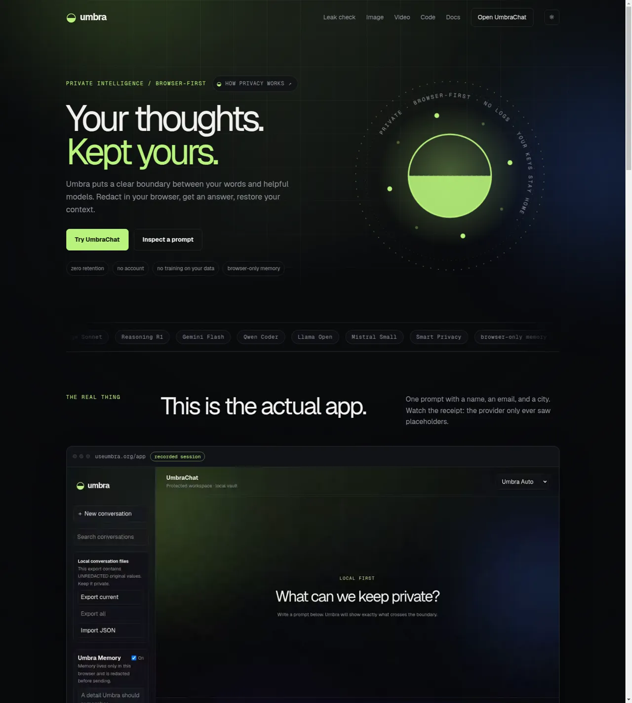
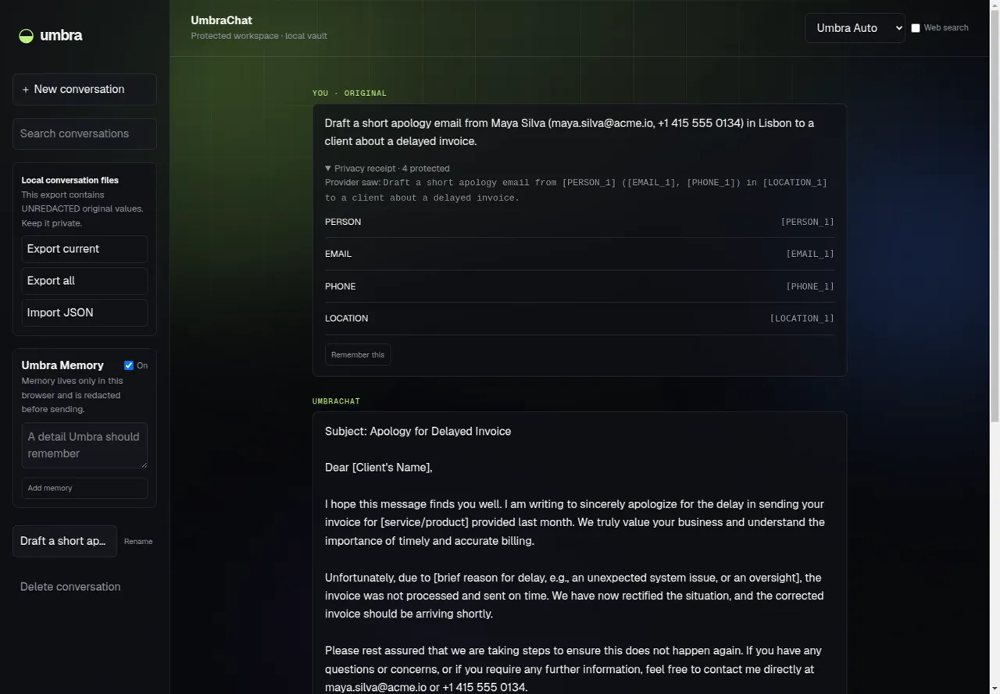
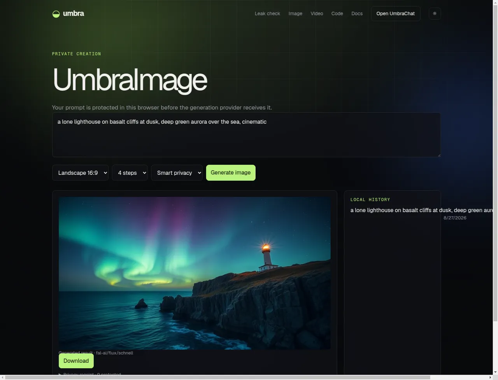
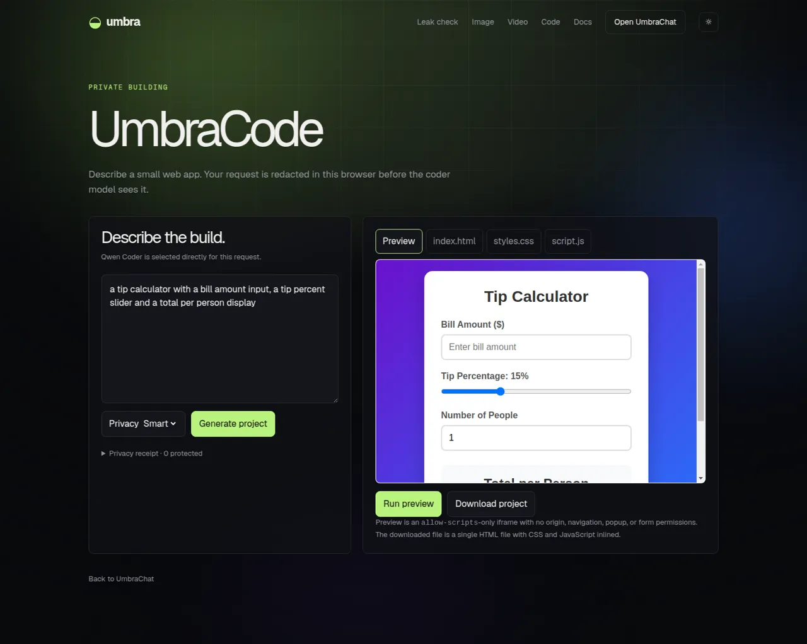
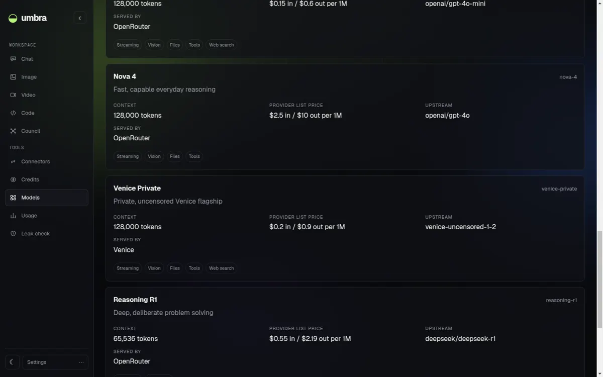
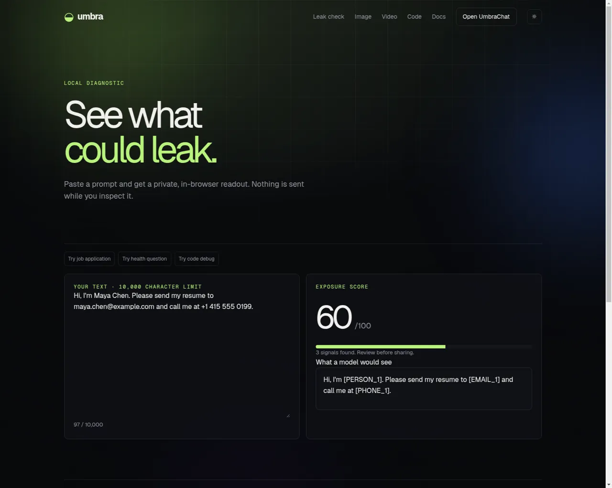

# Umbra

[](https://github.com/useumbra/umbra)

[Docs](https://useumbra.org/docs) · [Roadmap](https://useumbra.org/roadmap) · [Changelog](CHANGELOG.md) · [Contributing](CONTRIBUTING.md)

Sensitive details are stripped in the browser before any provider sees the prompt.

Umbra is not a model. It is a privacy boundary and router in front of OpenRouter, Venice, and fal.ai providers. Conversations, memory, the credits vault, and connectors live in the browser rather than on an Umbra application server.

## Demo

A real UmbraChat session: the prompt carries a name, email, phone, and city, and the privacy receipt shows what the provider actually received.


Full-resolution recording: [`public/demo/umbrachat.mp4`](public/demo/umbrachat.mp4).

## Screenshots

Every screenshot below is production [useumbra.org](https://useumbra.org), not a mockup.

### Landing



### UmbraChat privacy receipt

The original prompt stays in the browser; the provider sees `[PERSON_1]`, `[EMAIL_1]`, `[PHONE_1]`, `[LOCATION_1]`, and the answer comes back with the real values restored locally.



### UmbraImage



### UmbraCode



### Venice models

Venice runs as a second provider next to OpenRouter, with pricing, context window, and the upstream slug shown per model.



### Leak check



## Status

### What works now

- Browser-side Smart Privacy engine with 17 detectors, Smart/Full/Off modes, and reversible placeholders.
- Streaming chat through OpenRouter with `umbra-auto` model routing.
- Venice as a second provider with three models, streaming, Venice web search with citations, and a per-model provider label in the catalog.
- A Venice-backed MCP endpoint at `/api/mcp/venice` exposing `venice_web_answer`, `venice_characters_search`, and `venice_models` to the agentic tool loop.
- Optional web-search grounding with source citations.
- Browser-local Umbra Memory.
- File, PDF, and image attachments extracted and redacted in the browser.
- UmbraImage through fal.ai.
- UmbraVideo through the fal.ai queue with asynchronous submit and polling; renders take about two minutes.
- UmbraCode with a sandboxed iframe live preview.
- OpenAI-compatible API endpoint with persistent, revocable API keys managed in
  the developer page.
- Browser-local encrypted credits vault with a recovery file.
- Browser-local MCP connectors with manual tool runs and an experimental agentic tool loop capped at three rounds.
- Read-only Robinhood Chain wallet reads for ETH and USDG.
- The live $UMBRA contract address on Robinhood Chain is shown on the site.
- Signed $UMBRA holder proof can set an API key tier and its enforced daily quota.
- Verified holder proofs add 5%, 10%, or 20% credits to USDG top-ups from the verified wallet.
- Conversation search, export, and import.
- `/leak-check` diagnostics.
- `/docs` and `/roadmap`.

### What is not done yet

- Unlinkable credits.
- Holder early access and voting.
- Agentic tool use has not been tested against a real MCP server.
- Smarter cross-conversation memory.
- No automated end-to-end browser test suite.

## Repository layout

```txt
src/
├── app/                    # Next.js App Router pages and API routes
│   ├── api/                # Chat, media, MCP, and OpenAI-compatible endpoints
│   │   ├── agent/v1/       # OpenAI-compatible chat and model routes
│   │   ├── chat/           # Streaming chat route
│   │   ├── code/           # Code generation route
│   │   ├── image/          # Image generation route
│   │   ├── mcp/            # Browser connector proxy and Venice tool server
│   │   └── video/          # Video queue submit and status routes
│   ├── app/page.tsx        # UmbraChat workspace
│   ├── code/page.tsx       # UmbraCode workspace
│   ├── connectors/page.tsx # Browser-local MCP connector manager
│   ├── credits/page.tsx    # Local credits vault and wallet reads
│   ├── developers/page.tsx # API key and model information
│   ├── docs/page.tsx       # Product documentation
│   ├── image/page.tsx      # UmbraImage workspace
│   ├── leak-check/page.tsx # Local privacy diagnostics
│   ├── roadmap/page.tsx    # Product status and roadmap
│   ├── video/page.tsx      # UmbraVideo workspace
│   ├── page.tsx            # Landing page
│   ├── apple-icon.png      # Raster Apple touch icon
│   ├── icon.png            # Raster application icon
│   ├── icon.svg            # Vector application icon
│   ├── layout.tsx          # Root metadata and layout
│   └── globals.css         # Global styles
├── components/             # Page and client interface components
│   ├── Background.tsx      # Animated page background
│   ├── BoundaryArt.tsx     # Privacy boundary illustration
│   ├── ChatClient.tsx      # Chat, search, memory, citations, and tool loop
│   ├── ChatClient.module.css # Chat styles
│   ├── CodeGenerator.tsx   # Code generation and sandbox preview
│   ├── CodeGenerator.module.css # Code styles
│   ├── ConnectorsClient.tsx # Connector discovery and manual tool runs
│   ├── ConnectorsClient.module.css # Connector styles
│   ├── CreditsPanel.tsx    # Encrypted vault and wallet UI
│   ├── CreditsPanel.module.css # Credits styles
│   ├── DemoVideo.tsx       # Landing-page demo video
│   ├── Developers.module.css # Developer page styles
│   ├── Docs.tsx            # Documentation content
│   ├── Header.tsx          # Site navigation
│   ├── HeroSigil.tsx       # Landing-page mark
│   ├── Landing.tsx         # Landing-page content
│   ├── LeakChecker.tsx     # Local privacy diagnostics UI
│   ├── Marquee.tsx         # Landing-page marquee
│   ├── MediaGenerator.tsx  # Image and video generation client
│   ├── MediaGenerator.module.css # Media styles
│   ├── ModelHub.tsx        # Model selection content
│   ├── ProductShowcase.tsx # Product showcase content
│   ├── Reveal.tsx          # Scroll reveal wrapper
│   ├── Roadmap.tsx         # Roadmap content
│   ├── ThemeToggle.tsx     # Theme preference control
│   ├── XIcon.tsx           # X social icon
│   └── background.css      # Background styles
├── config/                 # Brand, chain, and model configuration
│   ├── brand.ts            # Umbra product and domain settings
│   ├── chain.ts            # Robinhood Chain settings
│   └── models.ts           # Available model routes and pricing
└── lib/                    # Privacy, storage, providers, routing, and utilities
    ├── privacy/            # Detectors, vaults, redaction, and restoration
    ├── providers/          # OpenRouter, Venice, fal.ai, and deterministic adapters
    ├── credits/            # Encrypted vault storage and pricing
    ├── attachments.ts      # Browser-side text, PDF, and image extraction
    ├── chat-features.ts    # Citation and tool-call parsing
    ├── connectors.ts       # Browser-local connector storage
    ├── mcp.ts              # MCP request helpers and validation
    ├── memory.ts           # Browser-local memory
    ├── storage.ts          # Conversation and settings storage
    └── wallet.ts           # Robinhood Chain wallet reads and USDG transfers
public/                     # Static assets and browser-served PDF.js files
scripts/                    # Build and development asset preparation
docs/                       # Project architecture documentation and README media
```

## Getting started

Umbra requires Node 22.

```bash
npm install
npm run dev
```

Open [http://localhost:3000](http://localhost:3000). The `predev` script copies the PDF.js worker and module into `public/` for browser-side PDF extraction.

## Configuration

Copy `.env.example` to `.env.local` for local development:

| Variable                               | Purpose                                                                                                                                |
| -------------------------------------- | -------------------------------------------------------------------------------------------------------------------------------------- |
| `OPENROUTER_API_KEY`                   | Enables live streaming chat through OpenRouter. Get a key from [openrouter.ai/settings/keys](https://openrouter.ai/settings/keys).     |
| `VENICE_API_KEY`                       | Enables the Venice models and the Venice-backed MCP endpoint. Get a key from [venice.ai/settings/api](https://venice.ai/settings/api). |
| `FAL_KEY`                              | Enables live image and video generation through fal.ai. Get a key from [fal.ai/dashboard/keys](https://fal.ai/dashboard/keys).         |
| `UMBRA_API_SECRET`                     | Signs and verifies API tokens for the OpenAI-compatible API endpoint; self-hosters can use it directly.                                |
| `NEXT_PUBLIC_UMBRA_TREASURY`           | Enables USDG top-ups to this Robinhood Chain treasury address. Must be a valid EVM address.                                            |
| `NEXT_PUBLIC_WALLETCONNECT_PROJECT_ID` | Optional WalletConnect project ID for mobile wallet QR connections. WalletConnect is hidden when empty.                                |

The production treasury is configured in the committed `.env.production`.
This `NEXT_PUBLIC_` value is public build configuration, not a secret.

Without `VENICE_API_KEY`, Venice models are hidden from the catalog and never fall back to another provider. Without `OPENROUTER_API_KEY`, chat uses a deterministic local stub. Without `FAL_KEY`, image and video use deterministic local stubs.

Generated API keys are shown once and stored only in the browser that created
them. With no accounts, possession of a key is the authorization to revoke it.
Self-hosted deployments can continue signing tokens directly with
`UMBRA_API_SECRET`.

On-chain USDG funding is available when `NEXT_PUBLIC_UMBRA_TREASURY` is set.
Transfers send real funds to that treasury, while the resulting credit ledger
remains encrypted and local to the browser. Clearing local data or losing the
recovery file loses the displayed balance; there is no implied refund or
server-held account balance.

## Verification

```bash
npx tsc --noEmit
npm run lint
npm run format:check
npm run test
npm run build
```

## Deployment

Umbra runs on Cloudflare Workers using OpenNext. Build and promote a version explicitly:

```bash
npx opennextjs-cloudflare build
npx wrangler versions upload
npx wrangler versions deploy <version-id>@100%
```

Plain `wrangler deploy` has left production serving stale assets, so versions must be uploaded and explicitly promoted. Worker secrets are configured with `wrangler secret put`; secret values and account credentials do not belong in this repository.

## Privacy model

### What leaves the browser

For normal chat and search, the redacted prompt and any redacted attachment or memory text sent with it leave the browser. The provider receives the protected conversation content through the relevant API route.

### What never leaves the browser

Original values, the placeholder map, browser-local memory, the encrypted credits vault, and the connector registry stay in browser storage. Umbra does not store conversations or connector configuration on an application server.

### Deliberate connector exception

When the user enables experimental agentic tool use, tool arguments are restored to their original values before being sent to the connector the user registered. Connector results are redacted in the browser before returning to the model. Manual connector invocation is also initiated by the browser.

## License

MIT. See [LICENSE](LICENSE).
